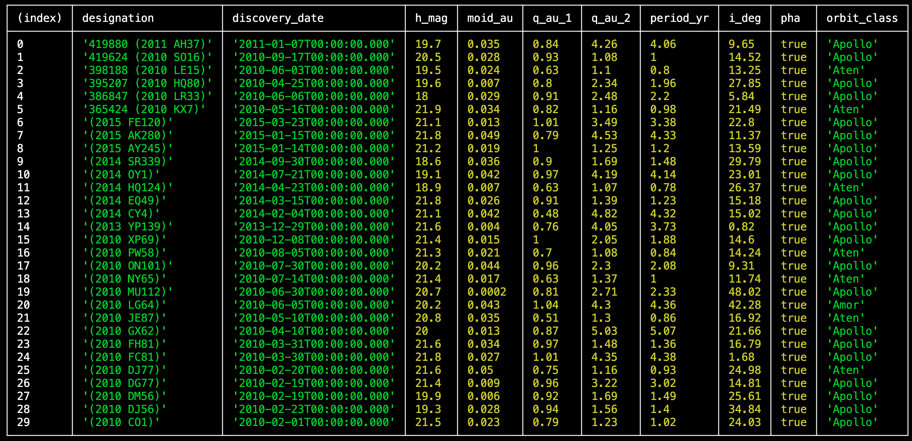
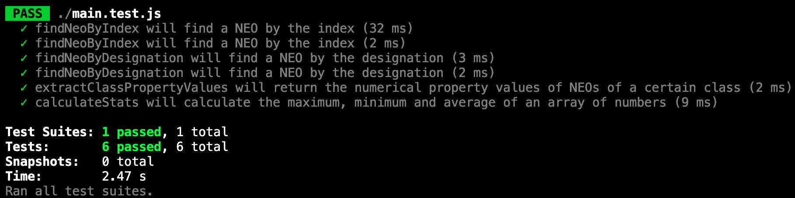

# Near Earth Objects JSON Analysis

## Overview
This project demonstrates the use of JavaScript and Node.js to analyze and transform data about Near Earth Objects (NEOs) provided by NASA. The dataset, in JSON format, contains 202 objects representing various properties of NEOs, including observed magnitude, orbital properties, and classification as asteroids or comets. The program performs the following tasks in five steps:

1. Loading JSON Data
2. Basic Functions
3. Data Analysis
4. Changing JSON Format
5. Unit Testing

This README outlines the structure, functionality, and development process of the project.

## Files Included
1. main.js: The main JavaScript file containing the program code.
2. main.test.js: Unit tests implemented using Jest.
3. NEO Analysis Report.pdf: Report detailing the implementation and analysis process.
4. NEOWISE_Dataset.json: The original dataset provided for analysis.
5. NEOWISE_classes.json: The rearranged JSON file sorted by NEO class type.

## Features
### Step 1: Loading JSON Data
- The JSON file is read and parsed into a JavaScript object using Node.js.
- Encapsulates the data-loading logic within a reusable function for modularity.

### Step 2: Basic Functions
Four key functions were developed:
- findNeoByIndex: Retrieves a NEO by its index in the dataset.
- filterByOrbitClass: Filters NEOs by their orbit class.
- filterByPha: Filters NEOs that are classified as Potentially Hazardous Asteroids (PHA).
- findNeoByDesignation: Searches for a NEO by its unique designation.

### Step 3: Data Analysis
- Created functions to analyze and compare NEO properties:
    - filterByPhaAndOrbitClass: Filters NEOs by both PHA status and orbit class.
    - calculateStats: Computes maximum, minimum, and average values for orbital properties.
- Used console.table for formatted output to visualize comparisons.
- Reverse-engineered definitions of NEO classifications (e.g., PHA criteria, asteroid/comet classes) using dataset analysis.

Example Results for functions using console.table:

filterByOrbitClass("Aten"):
.png)

filterByPha(true):

findNeoByDesignation("419880 (2011 AH37)"):
").png)

filterByPhaAndOrbitClass(true, "Aten"):
.png)

filterByPhaAndOrbitClass(false, "Aten"):
.png)

calculateStats(phaPropertyValues):
.png)

calculateStats(jupiterPropertyValues):
.png)

### Step 4: Changing JSON Format
- Rearranged the dataset into arrays sorted by NEO class type.
- Saved the new structure into a JSON file (NEOWISE_classes.json) for improved accessibility and usability.

### Step 5: Unit Testing
Utilized the Jest framework to test program functions:
- Checked valid and invalid inputs for findNeoByIndex and findNeoByDesignation.
- Verified the functions extractClassPropertyValues and calculateStats.

Results of unit testing:

## Key Findings
1. Potentially Hazardous Asteroids (PHA):
    - Defined by observed magnitude ≤ 22.0 and MOID ≤ 0.05 AU.
    - PHAs exhibit smaller orbital properties compared to non-PHAs.

2. Asteroid Classes:
    - Apollo: Earth-crossing asteroids (most likely to be PHAs).
    - Amor: Orbits farther from Earth (least likely to be PHAs).
    - Aten: Smallest orbits and MOIDs.

3. Comet Classes:
    - Identified unique orbital characteristics (e.g., Halley-type comets have the longest orbital inclinations).

## Technologies Used
- JavaScript: Core programming language for data analysis and manipulation.
- Node.js: Environment for file handling and JSON processing.
- Jest: Testing framework for unit tests.

## Conclusion
This project demonstrates the practical application of JavaScript programming fundamentals, emphasizing the analysis, transformation, and testing of data. By systematically addressing each task, the project illustrates how simple functions and logical operations can handle complex datasets, offering insights into NEO classifications and characteristics.